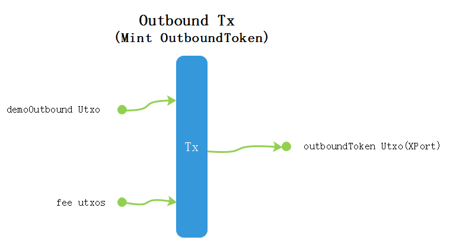
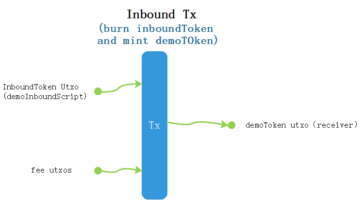

# cardano-crosschain-xport
Cardano scripts for XPort crosschain.

## Overview
This repository contains the scripts for implementing the XPort cross-chain protocol on the Cardano blockchain. XPort is a protocol used for transmitting messages between Cardano and various other blockchains, such as Ethereum, etc. The contracts description is [here](cross-chain/README.md) 


## Usage
When third-party applications integrate XPort, the following rules must be followed:
### Message Format
Third-party applications need to follow the message format defined by the XPort protocol as follows
``` haskell
data CrossMsgData = CrossMsgData
  {
    taskId :: BuiltinByteString
    , sourceChainId :: Integer
    , sourceContract :: MsgAddress
    , targetChainId :: Integer
    , targetContract :: MsgAddress
    , gasLimit :: Integer
    , functionCallData :: FunctionCallData
  }deriving (Show,  Prelude.Eq)
  
  data MsgAddress = ForeignAddress BuiltinByteString | LocalAddress Address deriving (Show, Prelude.Eq)
  
  data FunctionCallData = FunctionCallData
  {
    functionName :: BuiltinByteString
    , functionArgs :: BuiltinByteString
  }deriving (Show, Prelude.Eq)
  ```

1. taskId:Unique identifier for the message. Note that for outbound TX scenario, the taskId is a fixed empty string, and the final value will be generated based on the outbound Tx hash by offchain agent.
2. sourceChainId:The source blockchain id of the message.
3. sourceContract:The contract address of the initiator of the message.
4. targetChainId:The destination blockchain id of the message.
5. targetContract:The contract address of the destination of this message.
6. gasLimit: The upper limit of gas required for the message to be executed on the target chain. Note that for inbound TX scenario, it has no meaning.
7. functionCallData:Message execution parameters,including:
    - functionName:The name of the function that executes the message on the target chain, encoded in ascii. Note that it is fixed string of wmbReceive.
    - functionArgs:The parameters of the calling function, encoded in cbor. Note that Note that it is content is business specific and DApp can customize it accordingly.

### InBound Message:
The Xport system will mint an InboundToken to the address of the third-party contract (targetContract, as DAppIn) specified in the message. 

The InBound TX structure will basically contain:  
- Token MintFlag with InBoundToken, where the token name must be the scriptHash of the targetcontract addresst.
- Input CheckToken@InBoundMintCheck, which ensures the storeman MPC proof check.
- Output InBoundToken@DAppIn with CrossMsgData datum.

This InBoundToken@DAppIn shall be consumed by targetContract/DAppIn and burnt for business execution.

### OutBound Message:
The third-party application (sourceContract, as DAppOut) will mint an OutboundToken for message crosschain.

The OutBound TX structure will basically contain:  
- Token Mint Flag with OutBoundToken, where the mint policy shall check that input UTXO@DAppOut matches output OutBoundToken@XPort.
- Input UTXO@DAppOut, which ensure correct output OutBoundToken@XPort.
- Output OutBoundToken@XPort with CrossMsgData datum.

### Bussiness Customization for functionArgs in CrossMsgData
- To match codec between Cardano and EVM, the functionArgs shall be encoded with CBOR and its EVM peer shall encode/decode CBOR accordingly.
- To support concurrency, the functionArgs can contain a array of multiple messages as business intent.

### Tx graphic illustration
- Based on the demo contract in the msg-demo, the following figure illustrates Inbound Tx and Outbound Tx



### References
For XPort crosschain in EVM, you can check EVM XPort accordingly.

https://github.com/wanchain/message-bridge-contracts/blob/feat/non-evm/contracts/WmbGateway.sol

## Demo transactions 

### From Wanchain To Cardano

https://testnet.wanscan.org/tx/0x5120c402cf2b3e5065d5fa5f5b07a94c00b003c0df57c730c243419a12c65161?type=msg

https://testnet.wanscan.org/tx/0x7c1d28e7c30bf866caa010a25cd72843b6dd6daf8a315d60af7206df32da8c2c?type=msg

https://testnet.wanscan.org/tx/0x5f5f386b902ea4b157e8fd615b48e4c5b38e93a9833a1f7dfc506b795380941a?type=msg

### From Cardano To Wanchain

https://testnet.wanscan.org/tx/d9faa3ee8779f61539a9dd4626212c8be5572fca2ced3d11432d4e8e63c61a79?type=msg

https://testnet.wanscan.org/tx/51e04e670a4aefd9c580e1f3e1200e0da561b11c2dd3d0da2c9581e173a9904c?type=msg
